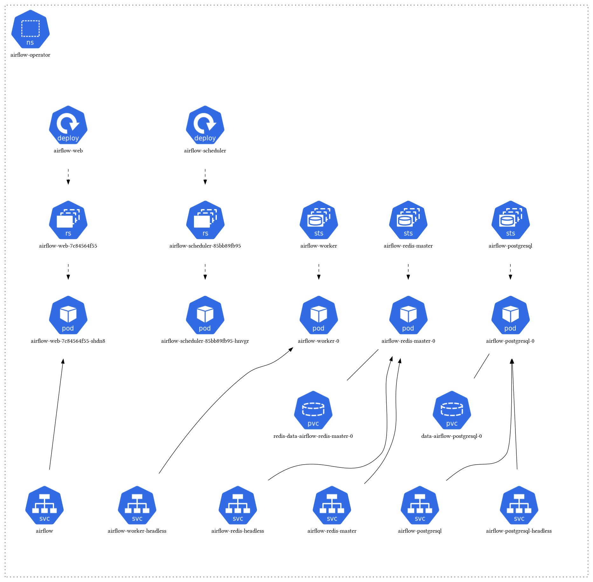
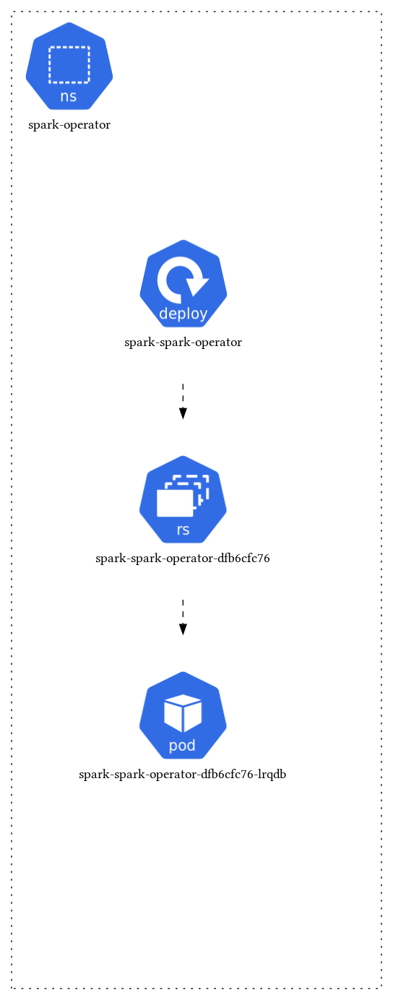
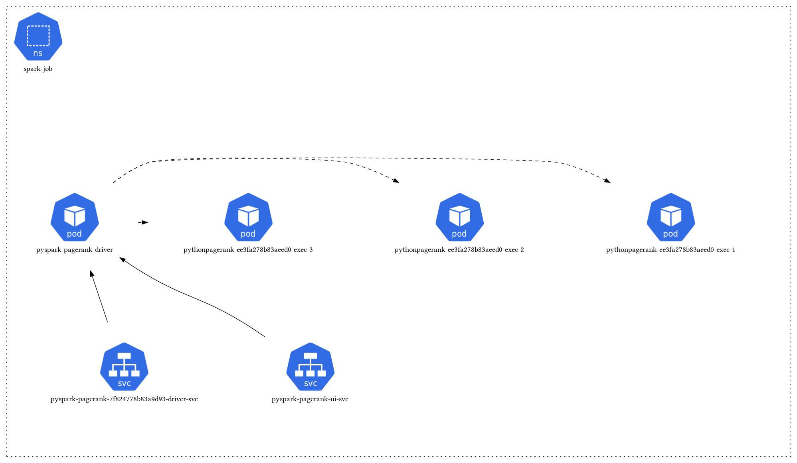
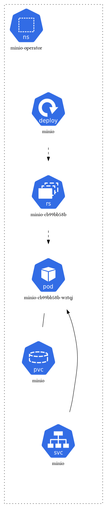
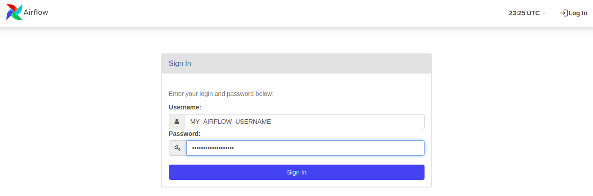
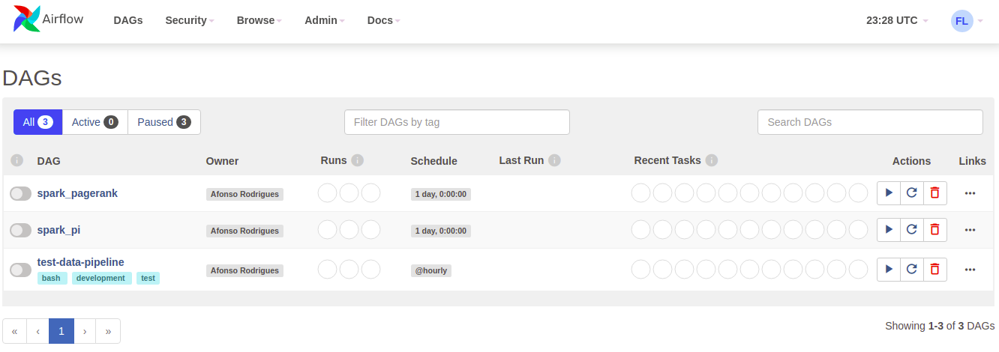
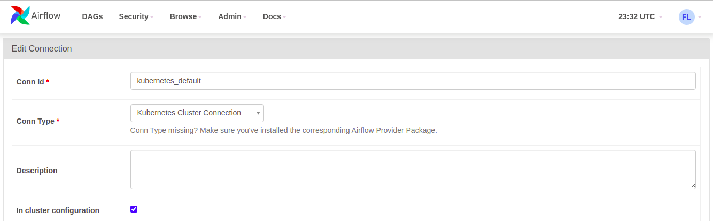
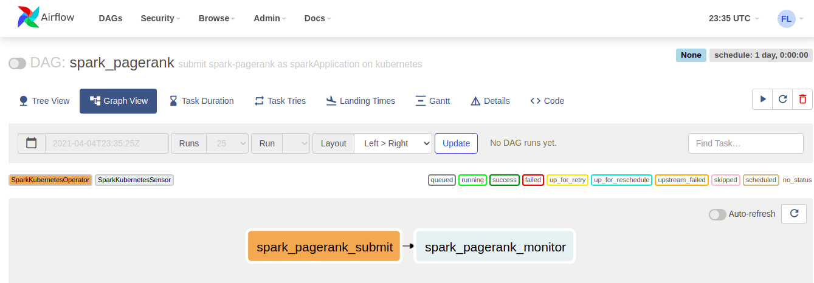
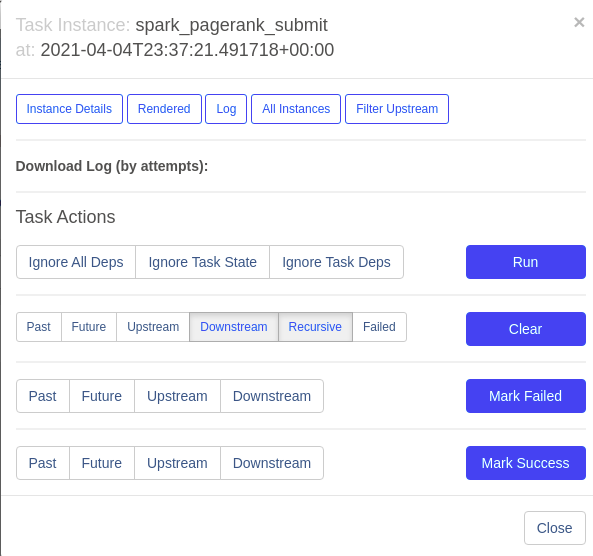
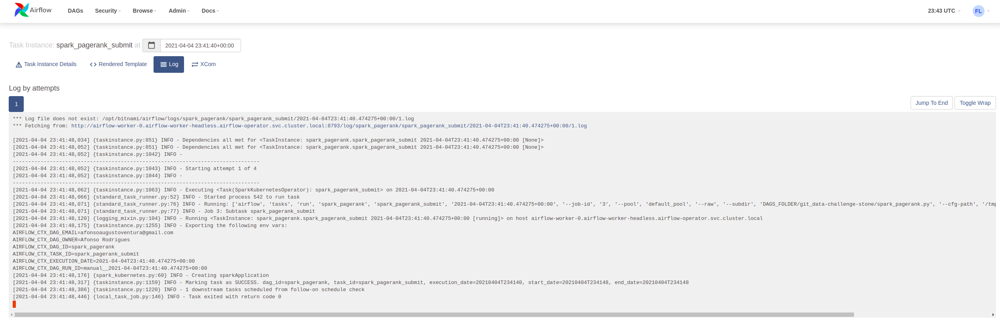

# Data-Challenge-Stone - Data Platform

[](https://www.deepcode.ai/app/gh/afonsoaugusto/data-challenge-stone/_/dashboard?utm_content=gh%2Fafonsoaugusto%2Fdata-challenge-stone)
[](https://circleci.com/gh/afonsoaugusto/data-challenge-stone/tree/main)

Desafio Data Challenge Stone na categoria Data Platform

- [Desafio](#desafio)
  * [Descrição](#descrição)
  * [Entrega 1](#entrega-1)
  * [Entrega 2](#entrega-2)
  * [Intens de avaliação da solução](#intens-de-avalia--o-da-solução)
  * [Intens de avaliação da apresentação](#intens-de-avaliação-da-apresentação)
- [Arquitetura](#arquitetura)
  * [Airflow Operator](#Airflow-Operator)
  * [Spark Operator](#Spark-Operator)
  * [Spark Job](#Spark-Job)
  * [Airflow Operator](#Airflow-Operator)
  * [Minio Operator](#Minio-Operator)
- [Estrutura do Projeto](#estrutura-do-projeto)
  * [Devcontainer](#Devcontainers)
  * [Pipeline](#pipeline)
    + [Estrutura do diretório spark-applications](#estrutura-do-diretório-spark-applications)
- [Solução](#solução)
  * [Kubernetes](#kubernetes)
    + [Kind](#Kind)
    + [Helm](#Helm)
  * [Kubernetes-Operators](#kubernetes-operators)
    + [spark-on-k8s-operator](#spark-on-k8s-operator)
    + [Minio-operator](#Minio-operator)
    + [Airflow-operator](#Airflow-operator)
  * [Local setup](#local-setup)
    + [Variaveis de ambiente](#variaveis-de-ambiente)
    + [Executando Local setup](#executando-local-setup)
  * [Cleanup environment](#cleanup-environment)
- [Execução dos jobs](#execução-dos-jobs)
  * [Pyspark-Operator](#pyspark-operator)
  * [Airflow-Operator](#airflow-operator)
    + [Acessando a console do airflow](#acessando-a-console-do-airflow)
    + [Executando o Workflow](#executando-o-workflow)
- [Deployando a solução em um ambiente com o cluster já disponivel](#deployando-a-solução-em-um-ambiente-com-o-cluster-já-disponivel)
  * [Passo 0 - configurar as variaveis de ambiente](#passo-0---configurar-as-variaveis-de-ambiente)
  * [Passo 1 - configurar o acesso ao cluster](#passo-1---configurar-o-acesso-ao-cluster)
  * [Passo 2 - instalar os operadores no cluster](#passo-2---instalar-os-operadores-no-cluster)
  * [Passo 3 - Evolução das aplicações](#passo-3---evolu--o-das-aplica--es)
- [TODO](#todo)
- [Referências](#referências)

## Desafio

### Descrição

Criar um cluster Spark no Kubernetes, e executar um job de spark com 3 [executors](https://spark.apache.org/docs/latest/cluster-overview.html#glossary).

Garanta de que cada nós do cluster de Kubernetes conversem entre si seguindo as boas práticas de segurança:

* Limitação de acesso a portas para a integração
* Criação de roles de usuários no cluster
  * Admin
  * Edit
  * View

O ambiente deve ser local e disponibilizado no github

### Entrega 1

Desenho da solução + Imagens de Docker

### Entrega 2

Apresentação do projeto em 20 min detalhando o problema e a solução implementada

### Intens de avaliação da solução

* (p 1.5) Deployability (roteiro de implentação)
* (p 1.5) Performance
* (p 1.5) Estrutura de códigos/artefatos (manutenibilidade)
* (p 2.0) Recuperação em caso de falhas
* (p 2.0) Documentação
* (p 1.5) Segurança

### Intens de avaliação da apresentação

* Conhecimento da solução implementada
* Storytelling
* Maiores dificuldades
* Beneficios da solução

## Arquitetura

O desenho da arquitetura está apresentado no relacionamento dos namespaces no k8s.


### Airflow Operator



### Spark Operator



### Spark Job

Namespace durante a execução de uma SparkApplication com seus 3 executors que foram definidos no parametro *spec.executor.instances* do yaml de configuração.



### Minio Operator



## Estrutura do Projeto

```sh
$tree -a -I .git -v
.
├── .circleci  ------------------------------------------ Diretório para o circleci                                           
│   └── config.yml  ------------------------------------- Configuração da pipeline do circle ci
├── .devcontainer  -------------------------------------- Configuração para utilizar o devcontainer do vscode para desenvolvimento
│   ├── Dockerfile  ------------------------------------- Dockerfile que será utilizado como terminal no vscode
│   ├── devcontainer.json  ------------------------------ Configurações do Devcontainer
│   └── library-scripts  -------------------------------- Scripts para auxiliar no setup ara rodar o Devcontainer docker-in-docker
│       ├── common-debian.sh  --------------------------- Script para setup basico para debian like
│       └── docker-in-docker-debian.sh  ----------------- Script para configuração do docker-in-docker
├── .env.private  --------------------------------------- Arquivo de variaveis privadas, essas variaveis devem ficar no ambiente de CI ou um vault e serem setadas no ambiente. (excluido no .gitignore)
├── .env.project  --------------------------------------- Arquivo de variaveis para customizar a execução do projeto
├── .gitignore  ----------------------------------------- .gitignore para não subir para o repositório arquivos não necessários
├── .kubectl_aliases  ----------------------------------- Carrega as variaveis dos arquivos .env e criar alguns alias para simplificar a utilização do Kubectl. alias k='kubectl'
├── Case-Plataforma-de-Dados-Data-Platform.pdf  --------- Definições e regras para este projeto
├── Makefile  ------------------------------------------- Makefile para automatizar os comandos mais recorrentes
├── README.md  ------------------------------------------ README.md
├── airflow-operator  ----------------------------------- Diretório para as configurações do airflow-operator
│   ├── 01-airflow.sh  ---------------------------------- Script para setup do operador
│   ├── airflow-namespace.yml  -------------------------- Definição do namespace utilizado pelo operador
│   ├── airflow-rbac.yml  ------------------------------- Definição da role e rolebind para o airflow utilizar o spark-operator
│   └── dags  ------------------------------------------- Diretório para conter as Dags (configuração dos workflows) do airflow
│       ├── spark-pagerank.yml  ------------------------- Exemplo de SparkApplication para a Dag spark_pagerank
│       ├── spark-pi.yml  ------------------------------- Exemplo de SparkApplication para a Dag spark_pi
│       ├── spark_pagerank.py  -------------------------- Definição da dag spark_pagerank
│       ├── spark_pi.py  -------------------------------- Definição da dag spark_pi
│       └── test-data-pipeline.py  ---------------------- Definição da dag test-data-pipeline (esta dag não utiliza o spark-operator)
├── docker  --------------------------------------------- Diretório para automatizar a criação das imagens para a applications
│   ├── Makefile  --------------------------------------- Makefile para automatizar os comandos *docker build* e *docker push*
│   ├── build.sh  --------------------------------------- Script para automatizar a criação dinamica das imagens
│   └── publish.sh  ------------------------------------- Script para automatizar a publicação dinamica das imagens
├── img  ------------------------------------------------ Diretório de imagens do README
├── kubernetes  ----------------------------------------- Diretório para conter a automação do kuberntes rodando local
│   ├── auxiliaries-setup  ------------------------------ Diretório para conter a automação de ferramentas auxiliares. (No caso é o minio uma interface para o S3 que poderia ser substituido pelo prorio S3)
│   │   ├── 01-minio.sh  -------------------------------- Script para instalação do minio-operator via helm
│   │   └── minio-namespace.yml  ------------------------ Definição do namespace para o minio-operator
│   └── local-setup ------------------------------------- Diretório para conter a configuração k8s local com kind 
│       ├── kind-config.yml.tmpl  ----------------------- Template para configuração do Kind - Ele vai receber de forma dinamica o nome do cluster a ser criado
│       └── scripts  ------------------------------------ Scripts auxiliares para iteração com o cluster
│           ├── 00-local-setup.sh  ---------------------- Script para realizar todo o setup
│           ├── 01-install-kind.sh  --------------------- Script para instalar o kind
│           ├── 02-install-kubectl.sh  ------------------ Script para instalar o kubectl
│           ├── 03-install-helm.sh  --------------------- Script para instalar o helm
│           ├── 04-install-mc-client.sh  ---------------- Script para instalar o client do minio
│           ├── 99-cleanup.sh  -------------------------- Script para remover o cluster kind
│           └── 101-setup-dashboard.sh  ----------------- Script para instalar o dashboard do kubernetes. Como ele é apenas para validar alguns estados do cluster de forma simplificada, ele ficou de fora do 00-local-setup.sh
├── notas.txt  ------------------------------------------ Notas de observações e scripts gerais para consulta rapida, este arquivo não é commitado. (excluido no .gitignore)
├── spark-applications ---------------------------------- Diretório para conter as aplicações Spark
│   └── pagerank ---------------------------------------- Aplicação pagerank
│       ├── Dockerfile ---------------------------------- Dockerfile para gerar a imagem da aplicação
│       ├── pagerank.py --------------------------------- Script pyspark da aplicação
│       └── pagerank.yml -------------------------------- Configuração da aplicação
└── spark-operator  ------------------------------------- Diretório do spark-operator
    ├── install-spark-operator.sh  ---------------------- Instalação do spark-operator com helm
    └── spark-namespaces.yml  --------------------------- Definição dos namespaces para o spark-operator

14 directories, 41 files
```

### [Devcontainer](https://code.visualstudio.com/docs/remote/containers)

Este projeto contem uma definição de devcontainer para execução local. 
Não é necessário utilizar a execução em container ou no vscode. 
Porém se estiver utilizando vscode, o devcontainer simplifica para ter o mesmo ambiente rodando local em que o projeto foi desenvolvido.

O Devcontainer cria executa um container e monta o diretório do projeto local no proprio container. 
Ele automatiza o mapeamento dos usuários da maquina com o container, portanto todo arquivo que for criado durante a execução não será com o root.


A estratégia utilizada foi a [docker-in-docker](https://itnext.io/docker-in-docker-521958d34efd), onde o container é executado em modo privilegiado e o mesmo tem acesso a recursos do docker da maquina.

### Pipeline

Hoje a pipeline está fazendo somente o build das imagens das aplicações no diretório [spark-applications](./spark-applications)

#### Estrutura do diretório spark-applications

* spark-applications
  * application-name
    * Dockerfile
    * application.py ou os arquivos necessaŕios
    * application.yml (Definição da SparkApplication para referência)

```sh
├── spark-applications
│   └── pagerank
│       ├── Dockerfile
│       ├── pagerank.py
│       └── pagerank.yml
```

## Solução

### Kubernetes

#### [Kind](https://kind.sigs.k8s.io/)

Foi escolhido o kind devido a possibilidade simular um cluster kubernetes com a possibilidade ser multi node para workers e termos HA para o control-plane.

Importante salientar que para ele operar é necessário apenas o docker. O Kubectl se torna necessário para interagir com o cluster.

#### [Helm](https://helm.sh/docs/)

Foi escolhido utilizar o *helm* para deployar os *operators* para simplificar a sua gestão e criação dos componentes necessários para a solução.

### Kubernetes-Operators

#### [spark-on-k8s-operator](https://github.com/GoogleCloudPlatform/spark-on-k8s-operator/)

O spark operator foi escolhido por ser uma simplificação do setup do spark no kubernetes. 

No projeto temos a aplicação *pagerank* declarada em dois locais:

```sh
├── airflow-operator               ----- Para Declaração da Dag no Airflow -----
│   └── dags
│       ├── spark-pagerank.yml
│       ├── spark_pagerank.py
├── spark-applications            ----- Para criar a imagem base e pode executar um SparkApplication diretamente -----
│   └── pagerank
│       ├── Dockerfile
│       ├── pagerank.py
│       └── pagerank.yml
```

#### [Minio-operator](https://github.com/minio/operator/blob/master/README.md)

O minio operator foi escolhido por ser uma interface de abstração para uma estrutura hdfs. 
Ele também cria um [pvc](https://kubernetes.io/docs/concepts/storage/persistent-volumes/) local caso não queira utilizar um s3 como storage.

Era intuito utilizar ele no projeto, porém não teve tempo habil para utilza-lo corretamente.

#### [Airflow-operator](https://github.com/bitnami/charts/tree/master/bitnami/airflow)

O airflow operator da bitinami foi escolhido por ser uma abstração para o Airflow. 
Fiz alguns testes com o operator oficial do airflow porém tive alguns problemas na configuração do mesmo.

O airflow foi escolhido para ser o orquestrador dos jobs spark para criar uma escalabidade do deploy dos jobs. 
Nele é utilizado a estratégia de clonar o repositório que contém a definição das Dag's.

Importante salientar que para o airflow utilizar o spark-operator e criar os jobs no namespace spark-job, foi necessário criar uma **Role** com a acesso ao grupo de api *sparkoperator.k8s.io* e uma **RoleBinding** para linkar a role e a **ServiceAccount** do *airflow-operator*. 
[airflow-rbac.yml](airflow-operator/airflow-rbac.yml)

### Local setup

#### Variaveis de ambiente

No arquivo [.env.project](.env.project) tem as variveis de ambiente utilizadas neste projeto. 
Na estrutura do arquivo, temos algumas variaveis comentadas (#), estas variaveis são sensiveis, e é interessante que apenas que elas não sejam versionadas e sim disponibilizadas por um vault.

Devido este projeto ser privado, é necessário definirmos uma variavel chamada **SOURCE_PERSONAL_ACCESS_TOKEN**, que é o token de acesso ao github (pode ser gerado em [github.com/settings/tokens](https://github.com/settings/tokens)) para o airflow poder clonar as DAG's definidas no folder [airflow-operator/dags](airflow-operator/dags).

#### Executando Local setup

```sh
sudo apt-get update && \
sudo apt-get install make -y
make setup
```

<details><summary>Show complete make setup</summary>
<p>

```sh
$ make setup
STEP: setup-local-install-binaries - Install kind k8s and binaries utilitys
Install kind in version v0.10.0
Install Kubectl in version v1.20.5
Install Helm in version 3
Helm v3.5.3 is already latest
Install mc-client
Setup finish
Setup finish
STEP: setup-local-init-kind - Initiate cluster kind
Creating cluster "data-challenge-stone" ...
 • Ensuring node image (kindest/node:v1.20.2) 🖼  ...
 ✓ Ensuring node image (kindest/node:v1.20.2) 🖼
 • Preparing nodes 📦 📦 📦 📦 📦 📦   ...
 ✓ Preparing nodes 📦 📦 📦 📦 📦 📦 
 • Configuring the external load balancer ⚖️  ...
 ✓ Configuring the external load balancer ⚖️
 • Writing configuration 📜  ...
 ✓ Writing configuration 📜
 • Starting control-plane 🕹️  ...
 ✓ Starting control-plane 🕹️
 • Installing CNI 🔌  ...
 ✓ Installing CNI 🔌
 • Installing StorageClass 💾  ...
 ✓ Installing StorageClass 💾
 • Joining more control-plane nodes 🎮  ...
 ✓ Joining more control-plane nodes 🎮
 • Joining worker nodes 🚜  ...
 ✓ Joining worker nodes 🚜
Set kubectl context to "kind-data-challenge-stone"
You can now use your cluster with:

kubectl cluster-info --context kind-data-challenge-stone

Thanks for using kind! 😊
STEP: setup-k8s-spark-operator - Install spark-operator
kubectl create namespaces for spark
namespace/spark-operator created
namespace/spark-job created
Helm add repository spark-operator
"spark-operator" already exists with the same configuration, skipping
Helm install spark-operator
W0405 00:28:12.144403  258372 warnings.go:70] apiextensions.k8s.io/v1beta1 CustomResourceDefinition is deprecated in v1.16+, unavailable in v1.22+; use apiextensions.k8s.io/v1 CustomResourceDefinition
W0405 00:28:12.476574  258372 warnings.go:70] apiextensions.k8s.io/v1beta1 CustomResourceDefinition is deprecated in v1.16+, unavailable in v1.22+; use apiextensions.k8s.io/v1 CustomResourceDefinition
W0405 00:28:14.685940  258372 warnings.go:70] apiextensions.k8s.io/v1beta1 CustomResourceDefinition is deprecated in v1.16+, unavailable in v1.22+; use apiextensions.k8s.io/v1 CustomResourceDefinition
W0405 00:28:17.211054  258372 warnings.go:70] apiextensions.k8s.io/v1beta1 CustomResourceDefinition is deprecated in v1.16+, unavailable in v1.22+; use apiextensions.k8s.io/v1 CustomResourceDefinition
W0405 00:28:17.398793  258372 warnings.go:70] apiextensions.k8s.io/v1beta1 CustomResourceDefinition is deprecated in v1.16+, unavailable in v1.22+; use apiextensions.k8s.io/v1 CustomResourceDefinition
NAME: spark
LAST DEPLOYED: Mon Apr  5 00:28:19 2021
NAMESPACE: spark-operator
STATUS: deployed
REVISION: 1
TEST SUITE: None
Setup finish
STEP: setup-auxiliaries-minio-operator - Install minio-operator
kubectl create namespaces for minio
namespace/minio-operator created
Helm add repository minio-operator
"bitnami" already exists with the same configuration, skipping
Helm install minio-operator
NAME: minio
LAST DEPLOYED: Mon Apr  5 00:28:38 2021
NAMESPACE: minio-operator
STATUS: deployed
REVISION: 1
TEST SUITE: None
NOTES:
** Please be patient while the chart is being deployed **

MinIO(R) can be accessed via port 9000 on the following DNS name from within your cluster:

   minio.minio-operator.svc.cluster.local

To get your credentials run:

   export ACCESS_KEY=$(kubectl get secret --namespace minio-operator minio -o jsonpath="{.data.access-key}" | base64 --decode)
   export SECRET_KEY=$(kubectl get secret --namespace minio-operator minio -o jsonpath="{.data.secret-key}" | base64 --decode)

To connect to your MinIO(R) server using a client:

- Run a MinIO(R) Client pod and append the desired command (e.g. 'admin info'):

   kubectl run --namespace minio-operator minio-client \
     --rm --tty -i --restart='Never' \
     --env MINIO_SERVER_ACCESS_KEY=$ACCESS_KEY \
     --env MINIO_SERVER_SECRET_KEY=$SECRET_KEY \
     --env MINIO_SERVER_HOST=minio \
     --image docker.io/bitnami/minio-client:2021.3.23-debian-10-r3 -- admin info minio

To access the MinIO(R) web UI:

- Get the MinIO(R) URL:

   echo "MinIO(R) web URL: http://127.0.0.1:9000/minio"
   kubectl port-forward --namespace minio-operator svc/minio 9000:9000
Added `minio-local` successfully.
Setup finish
STEP: setup-k8s-airflow-operator - Install minio-operator
kubectl create namespaces for airflow
namespace/airflow-operator created
Helm add repository airflow-operator
"bitnami" already exists with the same configuration, skipping
Helm install airflow-operator
NAME: airflow
LAST DEPLOYED: Mon Apr  5 00:28:47 2021
NAMESPACE: airflow-operator
STATUS: deployed
REVISION: 1
TEST SUITE: None
NOTES:
1. Get the Airflow URL by running:

  echo URL  : http://127.0.0.1:8080
  kubectl port-forward --namespace airflow-operator svc/airflow 8080:8080

2. Get your Airflow login credentials by running:
  export AIRFLOW_PASSWORD=$(kubectl get secret --namespace "airflow-operator" airflow -o jsonpath="{.data.airflow-password}" | base64 --decode)
  echo User:     MY_AIRFLOW_USERNAME
  echo Password: $AIRFLOW_PASSWORD
kubectl create rolebinding for use spark
role.rbac.authorization.k8s.io/airflow-sparkapplication created
rolebinding.rbac.authorization.k8s.io/airflow-sparkapplication created
Setup finish
```
</p>
</details>

### Cleanup environment

```sh
$ make clean
STEP: setup-local-cleanup - Destroy cluster kind
Deleting cluster "data-challenge-stone" ...
```

## Execução dos jobs

### Pyspark-Operator

Após subir o ambiente (com a instalação via kind, o conexto já é setado) e tendo acesso ao cluster, podemos acessar a solução.

```sh
vscode ➜ /workspaces/data-challenge-stone (main ✗) $ kubectl get nodes
NAME                                  STATUS   ROLES                  AGE   VERSION
data-challenge-stone-control-plane    Ready    control-plane,master   18m   v1.20.2
data-challenge-stone-control-plane2   Ready    control-plane,master   18m   v1.20.2
data-challenge-stone-control-plane3   Ready    control-plane,master   17m   v1.20.2
data-challenge-stone-worker           Ready    <none>                 17m   v1.20.2
data-challenge-stone-worker2          Ready    <none>                 17m   v1.20.2
data-challenge-stone-worker3          Ready    <none>                 17m   v1.20.2
vscode ➜ /workspaces/data-challenge-stone (main ✗) $ kubectl config get-contexts 
CURRENT   NAME                        CLUSTER                     AUTHINFO                    NAMESPACE
*         kind-data-challenge-stone   kind-data-challenge-stone   kind-data-challenge-stone   
vscode ➜ /workspaces/data-challenge-stone (main ✗) $ 
```

No cluster, temos configurado todos os operators acima citados. 
Como um primeiro exemplo irei executar a applicação **pagerank** via sparkOperator diretamente.

```sh
$ kubectl apply -f spark-applications/pagerank/pagerank.yml 
sparkapplication.sparkoperator.k8s.io/pyspark-pagerank created

$ kubectl get pods --namespace spark-job -w
NAME                      READY   STATUS              RESTARTS   AGE
pyspark-pagerank-driver   0/1     ContainerCreating   0          2m22s
pyspark-pagerank-driver   1/1     Running             0          2m23s
pythonpagerank-febf12789f23d742-exec-1   0/1     Pending             0          0s
pythonpagerank-febf12789f23d742-exec-2   0/1     Pending             0          0s
pythonpagerank-febf12789f23d742-exec-3   0/1     Pending             0          0s
pythonpagerank-febf12789f23d742-exec-1   0/1     ContainerCreating   0          8s
pythonpagerank-febf12789f23d742-exec-2   0/1     ContainerCreating   0          8s
pythonpagerank-febf12789f23d742-exec-3   0/1     ContainerCreating   0          8s
pythonpagerank-febf12789f23d742-exec-2   1/1     Running             0          11s
pyspark-pagerank-driver                  0/1     Completed           0          3m45s
pythonpagerank-febf12789f23d742-exec-2   0/1     Terminating         0          74s
pythonpagerank-febf12789f23d742-exec-2   0/1     Terminating         0          74s
pythonpagerank-febf12789f23d742-exec-2   0/1     Terminating         0          74s
```

Podemos obter os logs da execução com: 
* `kubectl logs pyspark-pagerank-driver --namespace=spark-job`

e os detalhes macro da aplicação com:

* `kubectl describe sparkapplications pyspark-pagerank --namespace=spark-job`

```sh
$ kubectl describe sparkapplications pyspark-pagerank --namespace=spark-job
Name:         pyspark-pagerank
Namespace:    spark-job
API Version:  sparkoperator.k8s.io/v1beta2
Kind:         SparkApplication
.
.
.
Events:
  Type    Reason                     Age                    From            Message
  ----    ------                     ----                   ----            -------
  Normal  SparkApplicationAdded      6m42s                  spark-operator  SparkApplication pyspark-pagerank was added, enqueuing it for submission
  Normal  SparkApplicationSubmitted  6m39s                  spark-operator  SparkApplication pyspark-pagerank was submitted successfully
  Normal  SparkDriverRunning         4m13s                  spark-operator  Driver pyspark-pagerank-driver is running
  Normal  SparkExecutorPending       4m8s                   spark-operator  Executor pythonpagerank-febf12789f23d742-exec-1 is pending
  Normal  SparkExecutorPending       4m8s                   spark-operator  Executor pythonpagerank-febf12789f23d742-exec-2 is pending
  Normal  SparkExecutorPending       4m7s                   spark-operator  Executor pythonpagerank-febf12789f23d742-exec-3 is pending
  Normal  SparkExecutorRunning       3m57s                  spark-operator  Executor pythonpagerank-febf12789f23d742-exec-2 is running
  Normal  SparkDriverCompleted       2m54s (x2 over 2m54s)  spark-operator  Driver pyspark-pagerank-driver completed
  Normal  SparkExecutorCompleted     2m54s                  spark-operator  Executor pythonpagerank-febf12789f23d742-exec-2 completed
  Normal  SparkApplicationCompleted  2m54s                  spark-operator  SparkApplication pyspark-pagerank completed
```

### Airflow-Operator

O operador do airflow está em execução, porém para acessar é necessário fazer um port-foward do cluster para a maquina. 
Caso não queira realizar o procedimento, pode-se criar um service com um escopo do tipo nodePort.

```sh
$ kubectl get all --namespace=airflow-operator
NAME                                     READY   STATUS    RESTARTS   AGE
pod/airflow-postgresql-0                 1/1     Running   0          37m
pod/airflow-redis-master-0               1/1     Running   0          37m
pod/airflow-scheduler-85bb89fb95-6778f   2/2     Running   0          37m
pod/airflow-web-7c84564f55-kqbpp         2/2     Running   0          37m
pod/airflow-worker-0                     2/2     Running   0          37m

NAME                                  TYPE        CLUSTER-IP      EXTERNAL-IP   PORT(S)    AGE
service/airflow                       ClusterIP   10.96.8.8       <none>        8080/TCP   37m
service/airflow-postgresql            ClusterIP   10.96.158.13    <none>        5432/TCP   37m
service/airflow-postgresql-headless   ClusterIP   None            <none>        5432/TCP   37m
service/airflow-redis-headless        ClusterIP   None            <none>        6379/TCP   37m
service/airflow-redis-master          ClusterIP   10.96.187.130   <none>        6379/TCP   37m
service/airflow-worker-headless       ClusterIP   None            <none>        8793/TCP   37m

NAME                                READY   UP-TO-DATE   AVAILABLE   AGE
deployment.apps/airflow-scheduler   1/1     1            1           37m
deployment.apps/airflow-web         1/1     1            1           37m

NAME                                           DESIRED   CURRENT   READY   AGE
replicaset.apps/airflow-scheduler-85bb89fb95   1         1         1       37m
replicaset.apps/airflow-web-7c84564f55         1         1         1       37m

NAME                                    READY   AGE
statefulset.apps/airflow-postgresql     1/1     37m
statefulset.apps/airflow-redis-master   1/1     37m
statefulset.apps/airflow-worker         1/1     37m
```

#### Acessando a console do airflow

O usuário e senha de acesso a console do Airflow são definidos nas variaveis *AIRFLOW_USERNAME* e *AIRFLOW_PASSWORD*

```sh
make k8s-port-foward-airflow
STEP: k8s-port-foward-airflow - Port Foward to access airflow console
Airflow web URL: http://127.0.0.1:8080
Forwarding from 127.0.0.1:8080 -> 8080
```



Após o login é possivel vizualizar as Dags definidas no projeto



É necessário fazer um ajuste na configuração da conexão com o kubernetes do airflow. 
Este ajuste é necessário devido a configuração customizada da connection não ter sido feita em um ConfigMap customizado ou na decalaração do helm.

```txt
Admin -> Connections -> edit kubernetes_default -> check In cluster configuration -> save
```



Essa configuração é necessária para que o airflow identifique que a conexão com o kubernetes que ele irá utilizar será local. 
Caso não executado recebemos o seguinte erro:

```txt
{taskinstance.py:1455} ERROR - Invalid kube-config file. No configuration found.
```

#### Executando o Workflow

Podemos acessar a dag e ver o seu workflow. [http://127.0.0.1:8080/graph?dag_id=spark_pagerank](http://127.0.0.1:8080/graph?dag_id=spark_pagerank)



Podemos triggar ela e após a execução do step ver o log que foi gerado.






## Deployando a solução em um ambiente com o cluster já disponivel

### Passo 0 - configurar as variaveis de ambiente

Pode ser utilizado os arquivos `.env.private` e `.env.project`, ou as variaveis podem ser injetas por outra estratégia.
Mas são necessárias:

```sh
MINIO_ACCESS_KEY=MY_MINIO_ACCESS_KEY
MINIO_SECRET_KEY=MY_MINIO_SECRET_KEY

AIRFLOW_USERNAME=MY_AIRFLOW_USERNAME
AIRFLOW_PASSWORD=MY_AIRFLOW_PASSWORD

# Para o airflow acessar clonar o repositório com as dags
SOURCE_USERNAME=                  # afonsoaugusto
SOURCE_PERSONAL_ACCESS_TOKEN=     # token gerado
SOURCE_REPOSITORY=                # data-challenge-stone
SOURCE_REPO_IDENTIFIER=           # data-challenge-stone
SOURCE_BRANCH=                    # main
SOURCE_BRAND=                     # github.com
```

### Passo 1 - configurar o acesso ao cluster

É necessário que ambiente que esteja executando, tenha acesso ao cluster. 
Os utilitários podem ser ser instalados atraves do comando `make setup-local-install-binaries`

### Passo 2 - instalar os operadores no cluster

Cada operador é opcional na sua instalação caso já tenha instalado.

* Spark: `make setup-k8s-spark-operator`
* Minio:  `make setup-auxiliaries-minio-operator`
* Airflow: `make setup-k8s-airflow-operator`

### Passo 3 - Evolução das aplicações

A aplicações são definidas em dois pontos:

* spark-applications -> onde é aplicação spark e a criação da sua imagem
* airflow-operator/dags -> onde é o workflow da mesma

```sh
├── airflow-operator               ----- Para Declaração da Dag no Airflow -----
│   └── dags
│       ├── spark-pagerank.yml
│       ├── spark_pagerank.py
├── spark-applications            ----- Para criar a imagem base e pode executar um SparkApplication diretamente -----
│   └── pagerank
│       ├── Dockerfile
│       ├── pagerank.py
```

Portanto, para continuar na adição de novas aplicações ou jobs é necessário:

* Criar um diretório para aplicação spark em spark-applications contendo
  * Dockerfile
  * source_code
* Criar uma dag definition e um spark definition no diretório airflow-operator/dags

## Mono-repo ou Multi-repo

Como o objetivo do challenge é uma proposta de solução então o mesmo foi desenvolvido em um unico repositório.
Porém inicialmente para evolução do projeto eu sugiro a divisão deste repositório em 3 projetos.

1. Um respositório para conter os scripts e a automação da criação do cluster
2. Um respositório para conter a automação da aplicação da estrutura dos operators e sua configuração
3. Um respositório para conter as Aplicações onde consiste na definição das Dags e do SparkApplication (application.language, libs, Dockerfile).

## TODO

* Automatizar a criação de connections do airflow
* Melhorar as configurações do airflow e/ou mudar o chart utilizado para cria-lo.
* Utilizar o minio disponibilizado no projeto
* Criar mais aplicações de exemplo
* Desenhar de forma mais detalhada a arquitetura do projeto
* Melhorar o build das imagens respeitando a branch onde está sendo executada, assim podendo ser referenciada mais especificamente na definição da Aplicação e ser testada em um ambiente de desenvolvimento/homologação
* Modificar estratégia de passagem de valores para a definição da aplicação spark, sendo possivel customizar o nome da imagem a ser executado

## Referências

* [kubectl/cheatsheet](https://kubernetes.io/pt/docs/reference/kubectl/cheatsheet/)
* [Kind](https://kind.sigs.k8s.io/)
* [Helm](https://helm.sh/docs/)
* [spark-on-k8s-operator](https://github.com/GoogleCloudPlatform/spark-on-k8s-operator/)
* [Minio-operator](https://github.com/minio/operator/blob/master/README.md)
* [Airflow-operator](https://github.com/bitnami/charts/tree/master/bitnami/airflow)
